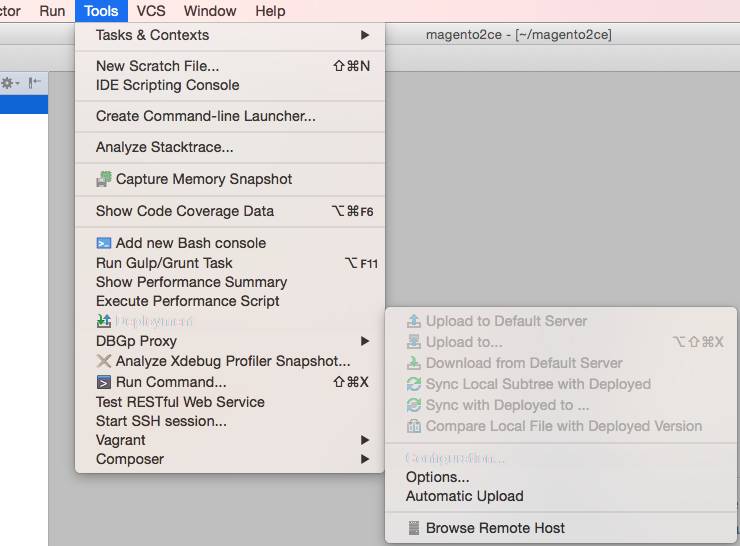
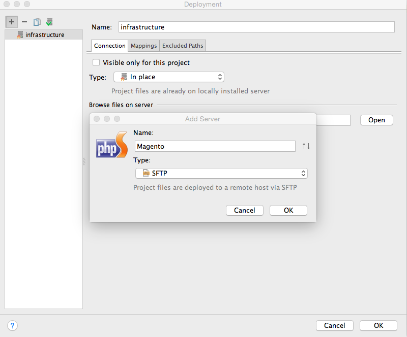
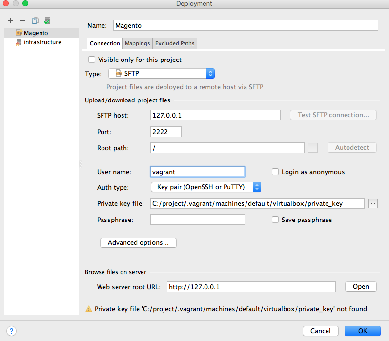
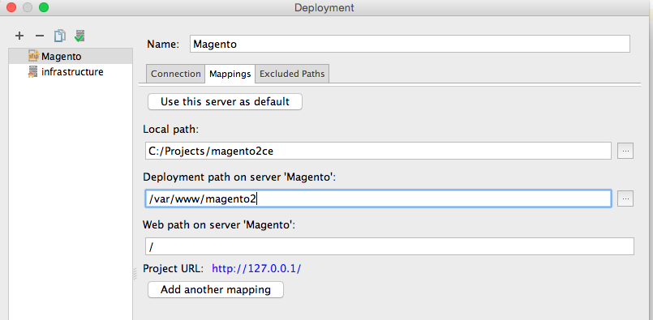
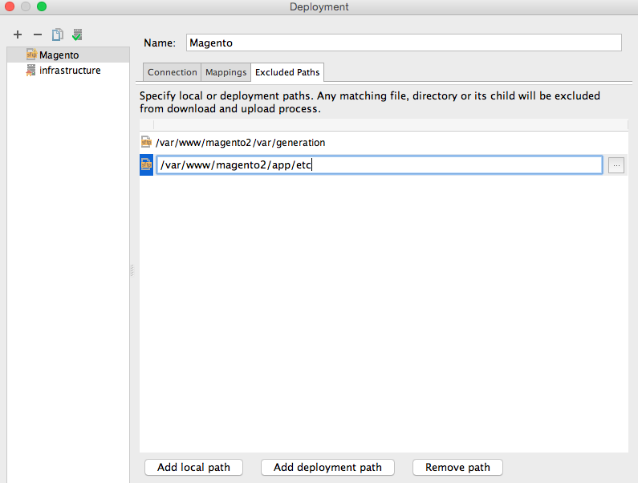
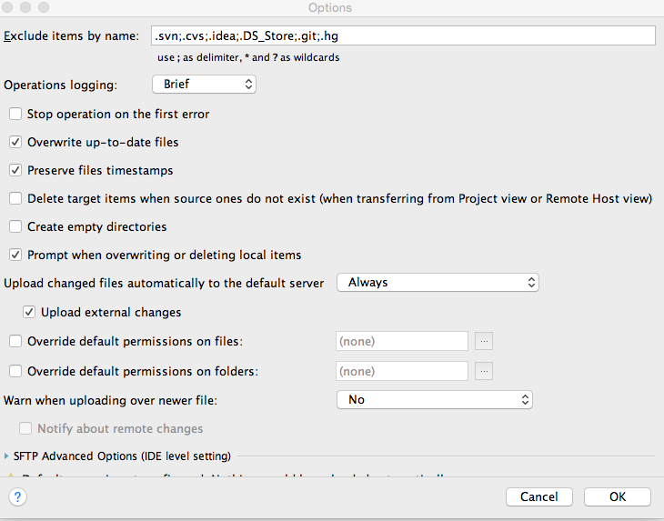

Synchronization with local PHP Storm
-----------------

This solution is applicable to any Vagrant configuration for Magento instance, several tweaks should be done:

 1. Set up synchronization in vagrant config file only for those directories, which require guest-to-host synchronization (can be of any type, even default). Recommended directories are already configured in Vagrant config:
    
    ```
    Vagrant.configure(2) do |config|
      config.vm.synced_folder '../magento2ce/var/generation', '/var/www/magento2ce/var/generation'
      config.vm.synced_folder '../magento2ce/app/etc', '/var/www/magento2ce/app/etc'
    end
    ```

 1. Open your project on host machine in PhpStorm and set up deployment configuration, which will upload to the guest machine everything except for those folders which are synchronized by Vagrant.  :information_source: Note that rsync can be used instead of PHP Storm deployment.
     1. Go to Tools -> Deployment -> Configuration

         

     1. Add new SFTP server and mark it as default when added (using button in top left corner)

         

     1. Fill out connection settings using the information taken from vagrant ssh config
         - Go to the 'vagrant-magento' directory (contains your vagrant project) in console and execute 'vagrant ssh-config'

             

         - Use private key Auth type instead of password
 
             

     1. Set up mapping between your local and remote versions of the project, for remote project use '/var/www/magento2ce'

         

     1. Add remote paths excluded from synchronization by PhpStorm. You should add those paths which are specified in Vagrant config for synchronization. 

         

     1. Go to Tools -> Deployment -> Options... and enable automatic upload to default server and check "Upload external changes"

        
